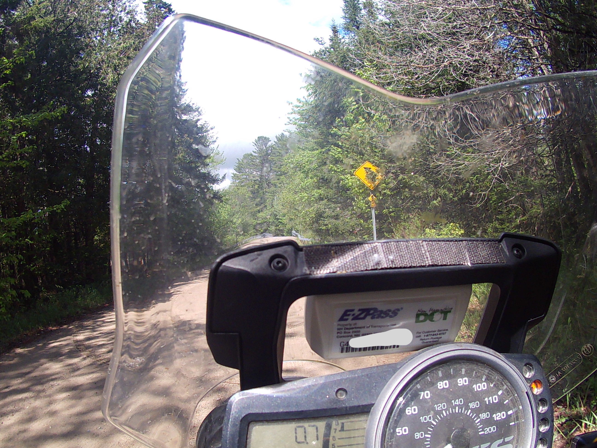
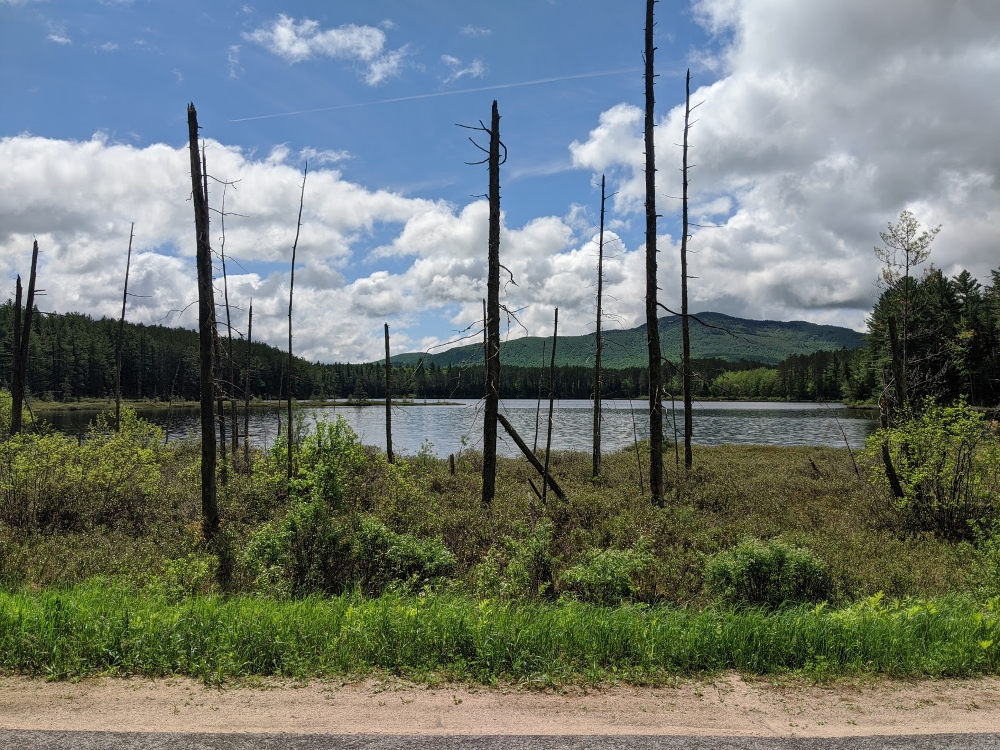
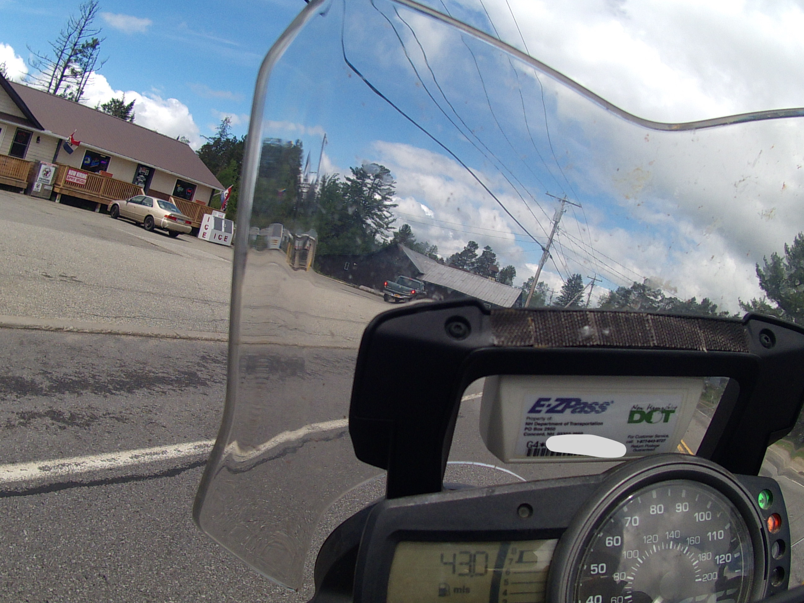

How far will your car go on "E"?

Once the little light pops on you know there's a good bit left to get you to a fill-up at the nearest station.  And I've pushed my car knowing that. A bit of googling says depending on make & model, most cars will get 30-50 miles.

But when the indicator light came on my bike this weekend I knew my little tank would **not** be so generous... or would it?
<!--more-->

I started with one of my favorite roads to start my trip; Strackville Road. The road is only about 6 miles but it includes deep ruts, water crossing, and packed and loose rocks to navigate.  Its a great technical ride.

{}

I had been back on tarmac for about 20 minutes when I turned onto Goldsmith rd, a class 3 packed gravel ride.  My indicator came on as soon as I straightened out.  Checking the map it was ~15 miles back to the last town, and ~10 miles to the next.  I knew the bike will get at least 15 miles on empty, so I pressed on.

County Road 26 was amazing, I wanted to really rev into some of these twisty turns, and stop at every other one to take a picture, but with my empty mileage counter growing I grew more nervous with every twist that only revealed more road.

Where CR26 ended was popular state road, but the town was a miss. Checking the map again, and searching for gas stations my heart dropped atleast another 12 miles in the wrong direction. Heading home there was one about 20 miles out.

Optimism in heart I was optimistic this now major highway would have some little place that no one bothered to mark on my GPS.

... Well 35 miles on empty now, I must be running on fumes.  I'm now scanning every house I pass (which are all to infrequent) for a lawn-mower, atv, or anything with a gas can I could beg for.

**43 miles on empty** -- and finally! a shop, oh now.. no pumps here. I let the clutch out again as I spot something in the corner of the little general store - a single hose hand-cranked gas pump! 

Wait, WAIT, turn-around!  Was that in fact an old hand-pump -- is it show or functional?  Do they actually have gas?! 

No option but to try!

Cash only, hand-cranked spinning wheels quickly brought my tank to full again.  The anxiety of leaving my bike and walking lord knows how far fades, I can finally resume taking in the scenery, and gosh what a ride.

